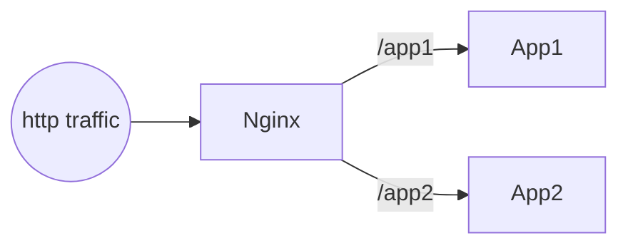
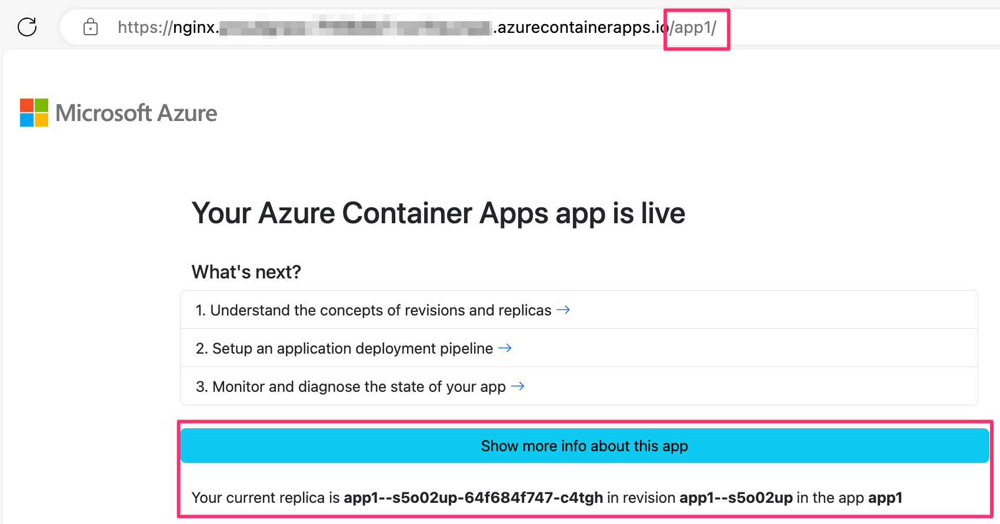

# Path-based routing solution in Azure Container Apps with NGINX

Azure Container Apps is a fully managed serverless container service that enables you to deploy and run containerized applications without having to manage the infrastructure.

By default, HTTP apps in Azure Container Apps are accessible via a public URL that is unique to the app. However, you can use a reverse proxy like NGINX to route traffic to multiple apps based on the path or hostname.

In this tutorial, you'll learn how to use Azure Container Apps to configure path-based routing for a set of containerized applications using NGINX as a reverse proxy.



## Deploy Azure Container Apps resources

1. Configure environment variables for the various resources you'll deploy:

    ```bash
    RESOURCE_GROUP_NAME=path-based-routing-rg
    LOCATION=northeurope
    STORAGE_ACCOUNT_NAME=pathbasedrouting$RANDOM
    ENVIRONMENT_NAME=path-based-routing
    ```

    Note: `$RANDOM` is a bash variable that returns a random number and is used here to generate a storage account that is globally unique within Azure. If it's not available in your shell, use another unique value for the `STORAGE_ACCOUNT_NAME` variable.

1. Create a resource group:

    ```bash
    az group create --name $RESOURCE_GROUP_NAME --location $LOCATION
    ```

1. Create an Azure Container Apps environment:

    ```bash
    az containerapp env create --name $ENVIRONMENT_NAME \
        --resource-group $RESOURCE_GROUP_NAME --location $LOCATION
    ```

1. Create two container apps in the environment:

    ```bash
    az containerapp create --name app1 --environment $ENVIRONMENT_NAME \
        --resource-group $RESOURCE_GROUP_NAME \
        --ingress internal --target-port 80

    az containerapp create --name app2 --environment $ENVIRONMENT_NAME \
        --resource-group $RESOURCE_GROUP_NAME \
        --ingress internal --target-port 80
    ```

    This will create two container apps, `app1` and `app2`. Both apps are not publicly accessible and are only accessible within the environment.

1. Create a container app running NGINX:
    
    ```bash
    az containerapp create --name nginx --environment $ENVIRONMENT_NAME \
        --resource-group $RESOURCE_GROUP_NAME \
        --ingress external --target-port 80 --image nginx
    ```

    This will create a container app running NGINX. The app is publicly accessible and is accessible from the internet. It'll be used as a reverse proxy to route traffic to the other two apps.

    The command should print the public URL of the NGINX app. Navigate to it to verify that the app is running.

Now that the Container Apps resources are created, you can proceed to configure the path-based routing.

## Configure path-based routing

To configure path-based routing, you'll create an NGINX configuration file that defines the routing rules and upload it to an Azure File Share. Then you'll mount the file share to the NGINX container app.

1. Create a storage account to store the NGINX configuration file:

    ```bash
    az storage account create --name $STORAGE_ACCOUNT_NAME \
        --resource-group $RESOURCE_GROUP_NAME --location $LOCATION \
        --sku Standard_LRS
    ```

1. Create a file share in the storage account:

    ```bash
    az storage share create --name nginx-config --account-name $STORAGE_ACCOUNT_NAME
    ```

1. In the current directory, create a new file called `nginx.conf` with the following content:

    ```nginx
    events {
    }

    http {
        server {
            listen 80;
            location /app1/ {
                proxy_http_version 1.1;
                proxy_pass http://app1/;
            }
            location /app2/ {
                proxy_http_version 1.1;
                proxy_pass http://app2/;
            }
        }
    }
    ```

    This NGINX configuration file defines two locations, `/app1/` and `/app2/`, and routes traffic to the `app1` and `app2` container apps respectively using their internal URLs, `http://app1/` and `http://app2/`.

1. Upload the NGINX configuration file to the file share:

    ```bash
    az storage file upload --account-name $STORAGE_ACCOUNT_NAME --share-name nginx-config \
        --source nginx.conf --path nginx.conf
    ```

1. Get the access key for the storage account:

    ```bash
    STORAGE_ACCOUNT_KEY=$(az storage account keys list --account-name $STORAGE_ACCOUNT_NAME \
        --resource-group $RESOURCE_GROUP_NAME --query "[0].value" --output tsv)
    ```

1. Configure the file share in the Container Apps environment:

    ```bash
    az containerapp env storage set \
        --name $ENVIRONMENT_NAME --resource-group $RESOURCE_GROUP_NAME \
        --storage-name nginx-config \
        --account-name $STORAGE_ACCOUNT_NAME \
        --azure-file-account-key $STORAGE_ACCOUNT_KEY --azure-file-share-name nginx-config \
        --access-mode ReadOnly
    ```

1. Export the YAML from the NGINX container app:

    ```bash
    az containerapp show --name nginx --resource-group $RESOURCE_GROUP_NAME \
        --output yaml > nginx.yaml
    ```

1. Open `nginx.yaml` in a text editor. Add the `volumes` array to the `template` section to mount the Azure File Share to the NGINX container app. Then add the `volumeMounts` array to the `containers` array to mount the volume to the NGINX container. The modified YAML should look like this snippet:

    ```yaml
    // ...
    properties:
      // ...
      template:
        containers:
        - image: nginx
          name: nginx
          resources:
            cpu: 0.5
            memory: 1Gi
          volumeMounts:
          - mountPath: /etc/nginx/nginx.conf
            subPath: nginx.conf
            volumeName: nginx-config
        scale:
          maxReplicas: 10
          minReplicas: 0
        serviceBinds: null
        terminationGracePeriodSeconds: null
        volumes:
        - name: nginx-config
          storageType: AzureFile
          storageName: nginx-config
    // ...
    ```

1. Update the NGINX container app with the modified YAML:

    ```bash
    az containerapp update --name nginx --resource-group $RESOURCE_GROUP_NAME \
        --yaml nginx.yaml
    ```

    This will update the NGINX container app to use the NGINX configuration file from the Azure File Share.

Navigate to the public URL of the NGINX app to verify that the path-based routing is working. Append `/app1/` and `/app2/` to the URL to verify that the traffic is being routed to the `app1` and `app2` container apps respectively.

Select *Show more info about this app* to see which container app is being used.



## Update the NGINX configuration

To update the NGINX configuration, change the `nginx.conf` in the file share.

Restart the NGINX container app to apply the changes:

```bash
az containerapp revision restart --name nginx --resource-group $RESOURCE_GROUP_NAME \
  --revision $(az containerapp revision list -n nginx -g $RESOURCE_GROUP_NAME --query '[0].name' -o tsv)
```

## Routing based on hostname

You can also configure NGINX to route traffic based on the hostname. To do this, use multiple server blocks in the NGINX configuration file, each with a different `server_name` directive.

```nginx
events {
}

http {
    server_names_hash_bucket_size 128;

    server {
        listen 80;
        server_name nginx.proudgrass-abcdefgh.northeurope.azurecontainerapps.io;

        location /app1/ {
            proxy_http_version 1.1;
            proxy_pass http://app1/;
        }
        location /app2/ {
            proxy_http_version 1.1;
            proxy_pass http://app2/;
        }
    }
    
    server {
        listen 80;
        server_name path-based-routing.anthonychu.dev;
        
        location /app3/ {
            proxy_http_version 1.1;
            proxy_pass http://app3/;
        }
    }
}
```

In the above example, traffic to `nginx.proudgrass-abcdefgh.northeurope.azurecontainerapps.io` is routed to `app1` and `app2`, while traffic to `path-based-routing.anthonychu.dev` is routed to `app3`.

Note the `server_names_hash_bucket_size 128;` directive. This is sometimes required when using a large number of server names, or in this case, when using a long domain name like the default one provided by Azure Container Apps.